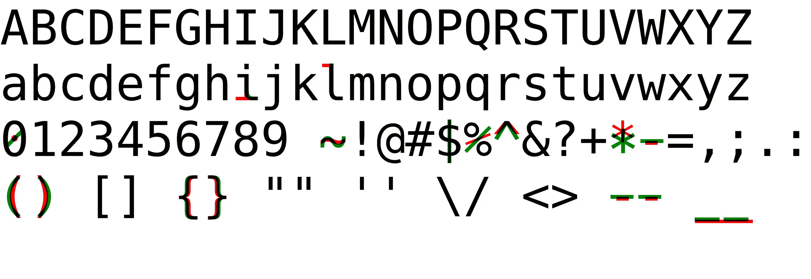
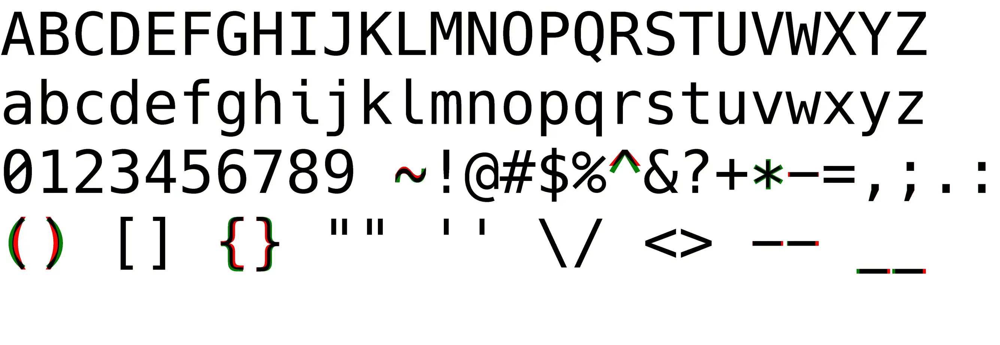

# Astacid
A DejaVu-based font for programming.

Astacid is based on [DejaVu Sans Mono - Bront](https://github.com/chrismwendt/bront), but includes glyphs from Hack and Ubuntu Mono.
Changes made to DejaVu Sans Mono - Bront include:

- `(` and `)` are not tapered
- `*` matches the size of `+`
- `-` is slightly narrower
- `^` is larger and more sharply angled
- `{` and `}` are enlarged
- `~` is curlier

Astacid is [patched with Nerd Font symbols](https://github.com/betaboon/nerd-fonts-patcher).

## Comparison to DejaVu Sans Mono

## Comparison to DejaVu Sans Mono - Bront

