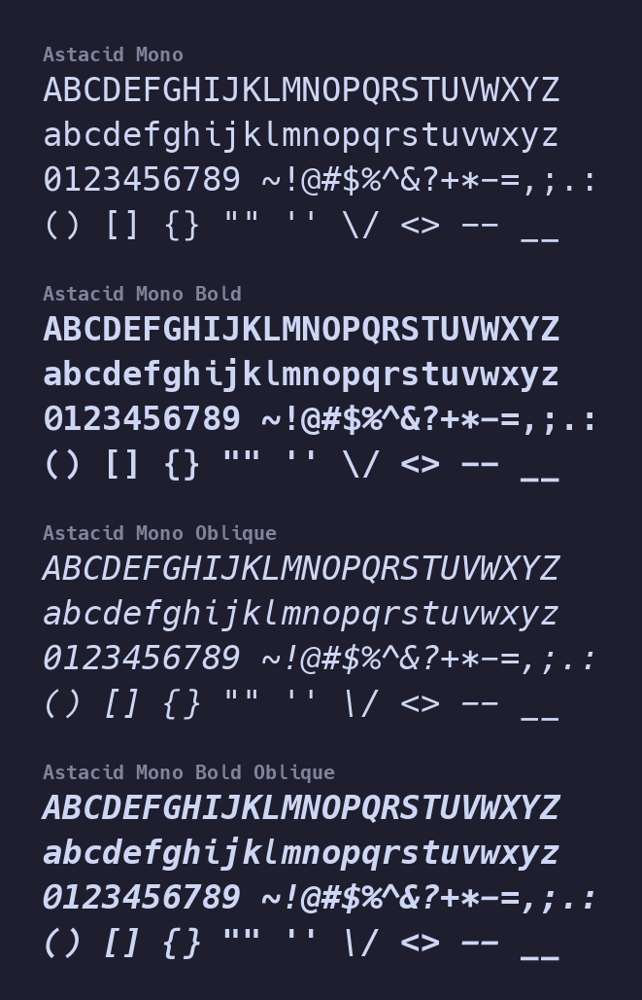
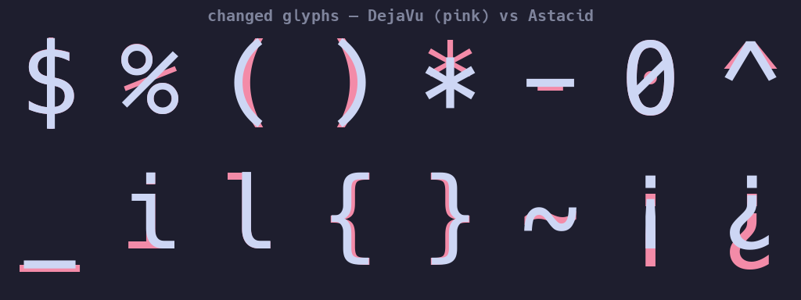

# Astacid Mono

A DejaVu-based monospace font for programming. DejaVu Sans Mono with hand-tuned glyphs, four styles, patched with the complete [Nerd Font](https://github.com/ryanoasis/nerd-fonts) set.



## Changed glyphs



| glyph | change |
|-------|--------|
| `( ) { }` | untapered parens, enlarged braces (Ubuntu Mono forms) |
| `*` | weight and size of `+`, raised |
| `-` | widened toward `_`, still clearly a hyphen |
| `^` | larger, more sharply angled |
| `~` | curlier |
| `$ % 0 _ i l ¡ ¿` | legibility and balance refinements |

## Build

Fully reproducible builds via Nix:

```sh
nix develop                # enter dev shell
ruff format && ruff check  # format & lint
python -m pytest tests/    # run tests
python build.py            # generate .TTFs in dist/
python build.py render     # generate .PNGs in assets/
nix build                  # generate result/share/fonts/truetype/*.ttf
```

Prebuilt faces are committed in [`dist/`](dist) — `nix build` reproduces them byte-for-byte. Glyph sources are editable UFO under [`sources/`](sources); the merge, Nerd patch, and metadata all live in a single [`build.py`](build.py).

## Credits & license

Astacid borrows glyphs from:
- [DejaVu](https://dejavu-fonts.github.io/) (a Bitstream Vera derivative, © 2003 Bitstream, Inc.),
- [DejaVu Sans Mono Bront](https://github.com/chrismwendt/bront),
- [Ubuntu Mono](https://fonts.google.com/specimen/Ubuntu+Mono),
- [Hack](https://github.com/source-foundry/Hack), and
- [Nerd Fonts](https://github.com/ryanoasis/nerd-fonts).

Astacid's own work is MIT; bundled glyphs retain their upstream licenses. See [LICENSE](LICENSE).
